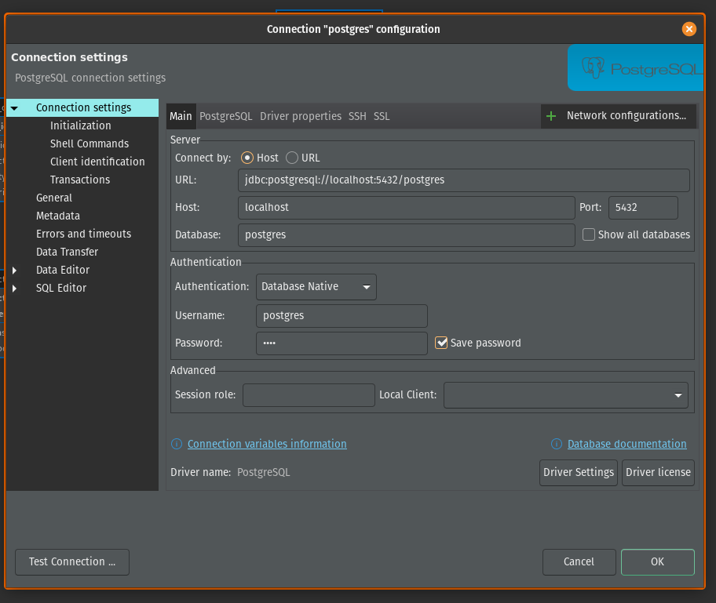
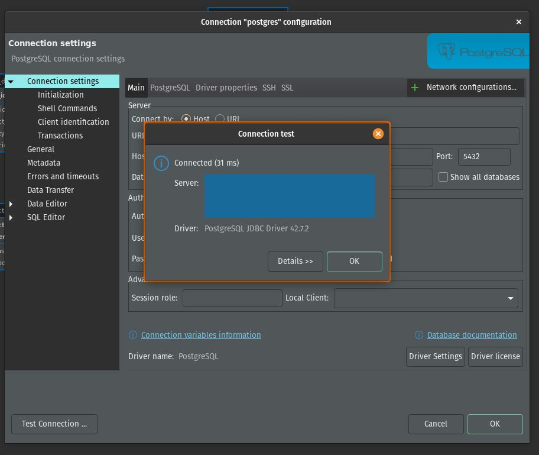
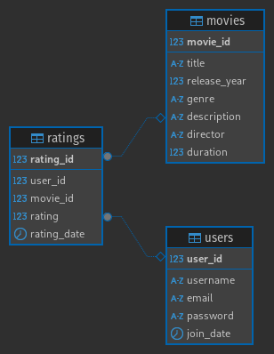
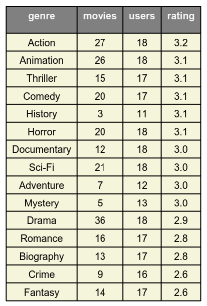
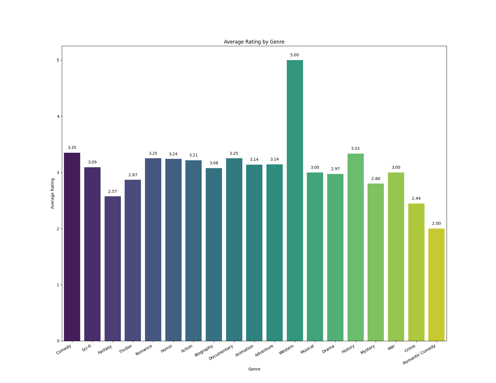
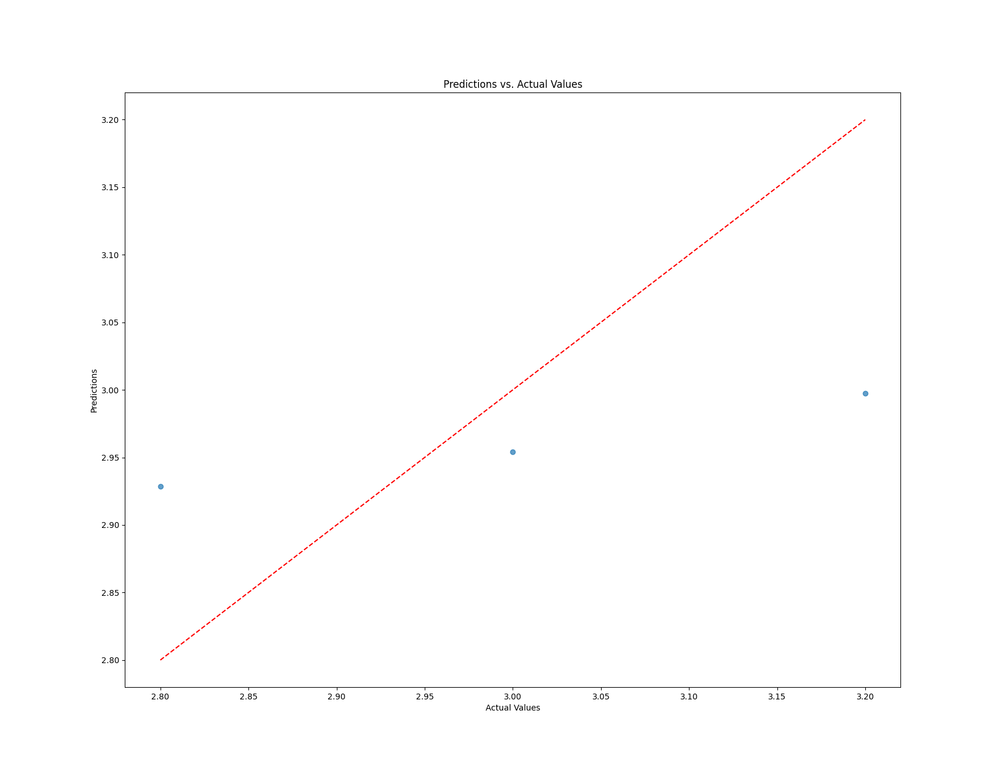

# 🎬 Movie Recommendation System  

This repository contains the development of a recommendation system using a movie dataset. It stores information in **PostgreSQL** and utilizes **Python** to build a machine learning model that suggests movies based on user preferences, leveraging **PostgreSQL, Pandas, and Scikit-learn**.  


## 🎯 Project Goals

- Develop an efficient recommendation system for movies based on user preferences.

- Utilize collaborative and content-based filtering techniques.

- Store and process data using PostgreSQL for scalability.

- Perform data analysis and visualization to understand rating trends.

## 📂 Folder Structure

```
├── sources/
│   ├── queries/          # SQL queries for fetching data
│   ├── models/           # Machine learning models
│   ├── data/             # Raw and processed data
├── notebooks/            # Jupyter notebooks for EDA & model training
├── images/               # Visual assets (plots, schema diagrams, etc.)
├── scripts/              # Automation scripts
├── README.md             # Documentation
```

## 🚀 Installation & Setup  

### Prerequisites  
Ensure you have the following installed:  
- **PostgreSQL** ([Download](https://www.postgresql.org/download/))  
- **Python 3.x** ([Download](https://www.python.org/downloads/))  
- **Required Python Libraries**:  

```
  pip install pandas scikit-learn psycopg2 faker matplotlib seaborn
```

- **DBeaver** (optional, for database visualization: [Download](https://dbeaver.io/download/))

## 🗄️ Database Schema

## <u>Connection</u>

1. In this case, we are going to use DBeaver, so the first thing we need to do is create a new connection.
- As shown in the picture, we need to configure the following settings:
    - **<u>Host</u>:** localhost
    - **<u>Database</u>:** postgres
    - **<u>Port</u>:** 5432
    - **<u>Username</u>:** postgres
    - **<u>Password</u>:** _YOUR PASSWORD_
<br>



2. After setting the parameters, we should test the connection to ensure it works before applying the configuration.

<br>



### 📌 Schema Diagram 



### `movies`
- **movie_id** (INT, PRIMARY KEY, AUTO_INCREMENT) - Unique identifier for each movie.
- **title** (VARCHAR(255)) - Title of the movie.
- **release_year** (INT) - Year the movie was released.
- **genre** (VARCHAR(100)) - Genre of the movie.
- **description** (TEXT) - Brief description of the movie.
- **director** (VARCHAR(100)) - Director of the movie.
- **duration** (INT) - Duration in minutes.
### `users`
- **user_id** (INT, PRIMARY KEY, AUTO_INCREMENT) - Unique identifier for each user.
- **username** (VARCHAR(50)) - Username.
- **email** (VARCHAR(100)) - User's email address.
- **password** (VARCHAR(255)) - Encrypted password.
- **join_date** (DATETIME) - Date the user registered.
### `ratings`
- **rating_id** (INT, PRIMARY KEY, AUTO_INCREMENT) - Unique identifier for each rating.
- **user_id** (INT, FOREIGN KEY) - Reference to the user who rated the movie.
- **movie_id** (INT, FOREIGN KEY) - Reference to the rated movie.
- **rating** (DECIMAL(3, 2)) - Rating given to the movie (e.g., from 1.0 to 5.0).
- **rating_date** (DATETIME) - Date the rating was made.

## 🔗 Relationships Between Tables
1. `movies` and `ratings` are related through `movie_id`, allowing storage of ratings given to each movie.
2. `users` and `ratings` are related through `user_id`, tracking which user gave a rating.

## 🤖 Use in a Recommendation System
- **Collaborative Filtering:** Uses ratings data to identify user preferences.
- **User-Based vs Item-Based Filtering:**
    - **User-based:** Finds similar users based on ratings.
    - **Item-based:** Suggests similar movies based on ratings.
- **Hybrid Approach:** Combines genre, director, and rating info.

## 🛠 Example Query for Recommendations

```
SELECT m.title, AVG(r.rating) AS avg_rating
FROM ratings r
JOIN movies m ON r.movie_id = m.movie_id
WHERE r.user_id IN (
    SELECT DISTINCT r1.user_id
    FROM ratings r1
    WHERE r1.movie_id = <USER_LAST_WATCHED_MOVIE>
)
GROUP BY m.title
ORDER BY avg_rating DESC
LIMIT 10;
```

## 📊 Data Analysis
### Average Rating by genre (table)

### Average Rating by genre (graphic)

### Predictions vs Actual Values (graphic)

### Decision Tree for High Rating Prediction (table)


## 🛡️ Security & Privacy

- User passwords are stored securely using hashing (e.g., bcrypt).

- Database access is restricted to authorized users.

- Sensitive user information is never exposed in raw format.

## 📌 Future Improvements

- Implement deep learning for better recommendations.

- Improve handling of cold-start problems for new users/movies.

- Integrate real-time recommendations using streaming data.

## 📚 Documentation

- [Postgres Documentation](https://www.postgresql.org/docs/)
- [Faker Documentation](https://faker.readthedocs.io/en/master/)
- [Random Documentation](https://docs.python.org/3/library/random.html)
- [Psycopg Documentation](https://www.psycopg.org/docs/)
- [Pandas Documentation](https://pandas.pydata.org/docs/)
- [ReportLab Documentation](https://www.reportlab.com/docs/reportlab-userguide.pdf)

## 🔗 Sources

- [DBeaver Community](https://dbeaver.io/download/)
- [Install Docker Desktop on Linux](https://docs.docker.com/desktop/setup/install/linux/)
- [Visual Studio Code](https://code.visualstudio.com/download)
- [Alacritty](https://github.com/alacritty/alacritty)

## 🤝 Contributions

Contributions are welcome! 🎉 <br>
Feel free to submit issues or pull requests to enhance the functionality.

## 📝 Contribution Guidelines
1. Fork the repository.
2. Create a feature branch (git checkout -b feature-branch).
3. Commit your changes (git commit -m "Added new feature").
4. Push to the branch (git push origin feature-branch).
5. Open a Pull Request.
6. For questions or suggestions, open an issue or contact me via email. 🚀