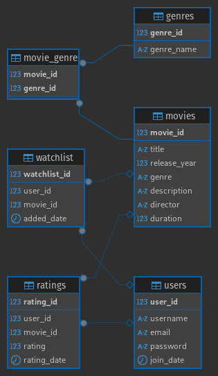
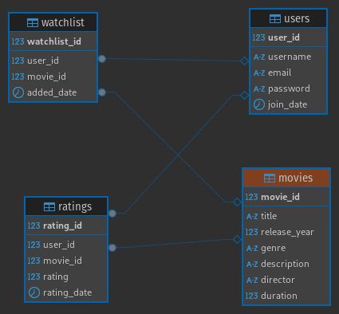

# Movie Recommendation System

## Database Schema

### Schema 1.0
- In the `movie` table there is a field named **genre**, so we don't need the tables:
    - `genres`
    - `movie_genre`

### Schema 2.0

### Schema 3.0

### `movies`
- **movie_id** (INT, PRIMARY KEY, AUTO_INCREMENT) - Unique identifier for each movie.
- **title** (VARCHAR(255)) - Title of the movie.
- **release_year** (YEAR) - Year the movie was released.
- **genre** (VARCHAR(100)) - Genre of the movie.
- **description** (TEXT) - Brief description of the movie.
- **director** (VARCHAR(100)) - Director of the movie.
- **duration** (INT) - Duration in minutes.
### `users`
- **user_id** (INT, PRIMARY KEY, AUTO_INCREMENT) - Unique identifier for each user.
- **username** (VARCHAR(50)) - Username.
- **email** (VARCHAR(100)) - User's email address.
- **password** (VARCHAR(255)) - Encrypted password.
- **join_date** (DATETIME) - Date the user registered.
### `ratings`
- **rating_id** (INT, PRIMARY KEY, AUTO_INCREMENT) - Unique identifier for each rating.
- **user_id** (INT, FOREIGN KEY) - Reference to the user who rated the movie.
- **movie_id** (INT, FOREIGN KEY) - Reference to the rated movie.
- **rating** (DECIMAL(3, 2)) - Rating given to the movie (e.g., from 1.0 to 5.0).
- **rating_date** (DATETIME) - Date the rating was made.
### `watchlist`
- **watchlist_id** (INT, PRIMARY KEY, AUTO_INCREMENT) - Unique identifier for each entry in the - watchlist.
- **user_id** (INT, FOREIGN KEY) - Reference to the user who added the movie.
- **movie_id** (INT, FOREIGN KEY) - Reference to the movie added to the list.
- **added_date** (DATETIME) - Date the movie was added to the list.
### `genres`
- **genre_id** (INT, PRIMARY KEY, AUTO_INCREMENT) - Unique identifier for each genre.
- **genre_name** (VARCHAR(100)) - Name of the genre.
### `movie_genres`
- **movie_id** (INT, FOREIGN KEY) - Reference to the movie.
- **genre_id** (INT, FOREIGN KEY) - Reference to the genre.
## Relationships Between Tables
1. `movies` and `ratings` are related through `movie_id`, allowing storage of ratings given to each movie.
2. `users` and `ratings` are related through `user_id`, tracking which user gave a rating.
3. `movies` and `movie_genres` are related to handle multiple genres per movie.
4. `users` and `watchlist` are related to manage the list of movies a user wants to watch.
## Use in a Recommendation System
- **Collaborative Filtering:** Use the `ratings` table to find similar behavior patterns among different users.
- **Content-Based Filtering:** Use the `movie_genres` table to recommend movies with similar genres to those a user has rated well.
- **Hybrid Recommendation:** Combine both approaches to improve the accuracy of recommendations.